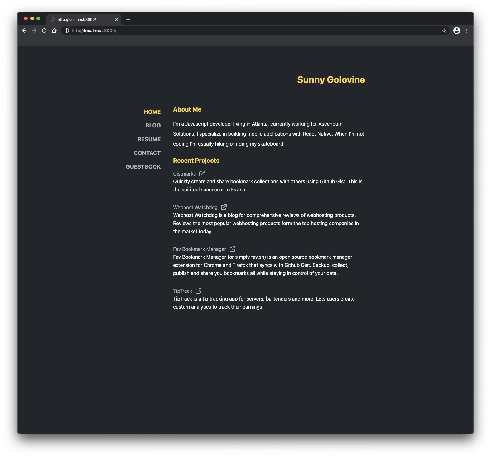

## My Website



[Hosted at sunnygolovine.com](https://sunnygolovine.com)


[View Code](https://github1s.com/sgolovine/sunnygolovine.com)

## Prerequisites

- NodeJS v10+
- Yarn (`npm install -g yarn`)

## Setup

1. Install Dependencies

```bash

yarn install

```

2. Login to Netlify

```bash
yarn netlify login # login to netlify
yarn netlify --telemetry-disable # disable telemetry

```

3. Setup ENV

Create a file named `.env` and copy the values from `.env.exmple`. Replace values with your own.

## Commands

```bash
  # Build the app
   - build
      NODE_ENV=production next build && next export

  # Build the app but don't export (used in CI)
   - build:dry
      NODE_ENV=production next build

  # Run CI commands locally (prettier + typescript)
   - ci
      tsc && yarn run format

  # Clean local project cache
   - clean
      rm -rf ./.next ./out

  # Run Prettier
   - format
      prettier --write '{src,functions,public,data}/**/*.{ts,tsx,js,json}'

  # Run with local netlify backend (for testing functions)
   - netlify-dev
      NODE_ENV=development netlify dev

  # Create a blog post post:create <new_post_name>
   - post:create
      node scripts/createPost.js

  # Delete a post post:delete <post_filename>
   - post:delete
      node scripts/deletePost.js

  # List all posts in the /posts directory
   - post:ls
      node scripts/listPosts.js

  # Serve local content
   - serve
      next start

  # Start the dev server
   - start
      NODE_ENV=development next dev

  # Test production builds locally
   - test-prod
      yarn build && yarn serve

```

### Blog Workflow Commands

```bash

yarn post:create <post_name> #create a new post
yarn post:delete <post_name> # delete a post

```
